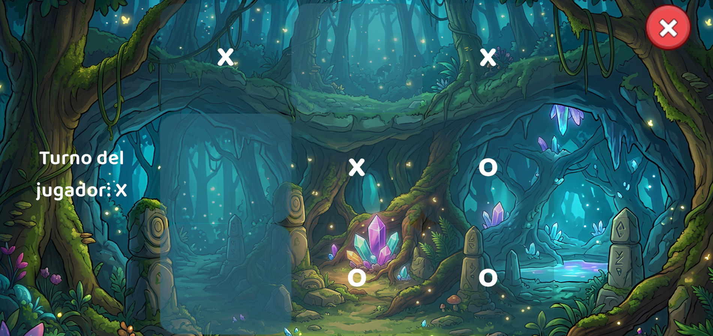

# Gato
Unity Tic-Tac-Toe with responsive UI, audio feedback, and animated win highlights.

## 🎯 Project Summary
Gato is a Unity 2D Tic-Tac-Toe prototype focused on clear turn-based gameplay, responsive UI, and polished win feedback. The objective was to create a small-scale game that demonstrates reliable state management, UI event handling, and cross-platform playability for editor and WebGL targets.

## 🎮 Project Overview
Players alternate between X and O on a 3x3 grid while the game checks for winning lines, draws, and resets cleanly. The experience is designed to feel crisp, with button animations and audio cues reinforcing game flow and victory states.

## ✨ Key Features
- ✅ Turn-based Tic-Tac-Toe gameplay with X/O alternating logic
- ✅ Win detection across rows, columns, and diagonals
- ✅ Animated button pulse effect on victory
- ✅ Restart and quit handling for editor and WebGL contexts
- ✅ Modular UI handling with button listeners and status text updates

## 🖼️ Preview

- Demo URL: none public yet

To publish a demo, build the project for WebGL and host the output on Netlify or GitHub Pages.

## 📁 Project Structure
- `Assets/Scripts/`: gameplay logic and UI controllers
- `Builds/`: existing standalone build artifacts
- `ProjectSettings/`: Unity project configuration and player settings
- `Gato.sln` / `Assembly-CSharp.csproj`: Visual Studio solution and script project

## 🏗 Architecture Highlights
- Event-driven MonoBehaviour architecture with UI button listeners
- Centralized game state managed in a single controller
- Coroutine-based UI animation for win effects
- Clean separation between input handling, game state, and UI updates

## 🛠 Technology Stack
- Unity: engine foundation for 2D UI, scene flow, and build targets
- C#: game logic, state transitions, and UI interaction code
- Universal Render Pipeline: optimized rendering path for modern Unity projects
- TextMeshPro: high-quality text rendering for game status and buttons
- AudioSource: sound playback for game feedback and polish

## ✅ Code Quality & Engineering Practices
- Uses serialized fields for inspector-driven configuration
- Avoids hard-coded UI behavior by wiring button events dynamically
- Supports restart and state reset without reconstructing the scene
- Includes platform-specific handling for WebGL quit behavior

## 🚀 How to Build & Run Locally
1. Open Unity Hub and add the project folder at `e:\Dev\Unity\Gato`.
2. Open the main scene and press Play in the Unity Editor.
3. For code editing, open `Gato.sln` in Visual Studio.

### Build
- In Unity, go to `File > Build Settings...`.
- Add the active scene if needed.
- Choose `Standalone Windows` or `WebGL` and click `Build`.

### Deploy
- Build for WebGL, then host the generated folder on Netlify or GitHub Pages.
- Alternatively, open the existing Windows build in `Builds/` for local testing.

## 🧠 Development Insights
This project was built as a compact portfolio piece to validate game state control, user feedback design, and Unity UI workflows. It balances gameplay logic with visual polish.

## 📚 Learning Outcomes
- Demonstrated reliable win/draw detection in a turn-based board game
- Practiced dynamic UI wiring and coroutine-driven animation
- Reinforced Unity platform conditionals for editor vs WebGL behavior

## 📬 Contact
- GitHub: [https://github.com/AbrahamSanchezDev/Gato](https://github.com/AbrahamSanchezDev/Gato)

---

# Gato
Unity Tic-Tac-Toe con interfaz de usuario receptiva, retroalimentación de audio y animaciones de victoria.

## 🎯 Resumen del proyecto
Gato es un prototipo 2D de Tic-Tac-Toe en Unity centrado en una jugabilidad por turnos clara, UI reactiva y retroalimentación de victoria pulida. El objetivo fue crear un juego de pequeña escala que demuestre gestión de estado fiable, manejo de eventos de UI y jugabilidad multiplataforma para editor y WebGL.

## 🎮 Descripción del proyecto
Los jugadores alternan entre X y O en una cuadrícula de 3x3 mientras el juego verifica líneas ganadoras, empates y reinicios de forma limpia. La experiencia está diseñada para sentirse nítida, con animaciones de botones y señales de audio que refuerzan el flujo de juego y los estados de victoria.

## ✨ Características clave
- ✅ Jugabilidad por turnos de Tic-Tac-Toe con lógica de alternancia X/O
- ✅ Detección de victoria en filas, columnas y diagonales
- ✅ Efecto de pulso animado en botones al ganar
- ✅ Manejo de reinicio y salida para editor y WebGL
- ✅ Control modular de UI con listeners de botones y actualizaciones de texto de estado

## 🖼️ Vista previa

- URL de demo: ninguna pública aún

Para publicar una demo, genera un build WebGL y aloja la salida en Netlify o GitHub Pages.

## 📁 Estructura del proyecto
- `Assets/Scripts/`: lógica de juego y controladores de UI
- `Builds/`: artefactos de build independientes existentes
- `ProjectSettings/`: configuración del proyecto Unity y ajustes de jugador
- `Gato.sln` / `Assembly-CSharp.csproj`: solución de Visual Studio y proyecto de scripts

## 🏗 Aspectos de arquitectura
- Arquitectura MonoBehaviour basada en eventos con listeners de botones de UI
- Estado de juego centralizado gestionado en un controlador único
- Animación de UI basada en corutinas para efectos de victoria
- Separación limpia entre manejo de entrada, estado de juego y actualizaciones de UI

## 🛠 Stack tecnológico
- Unity: motor para UI 2D, flujo de escenas y objetivos de build
- C#: lógica de juego, transiciones de estado e interacción de UI
- Universal Render Pipeline: ruta de renderizado optimizada para proyectos Unity modernos
- TextMeshPro: renderizado de texto de alta calidad para estado del juego y botones
- AudioSource: reproducción de sonido para retroalimentación de juego y pulido

## ✅ Calidad de código y prácticas de ingeniería
- Usa fields serializados para configuración desde el inspector
- Evita comportamiento de UI codificado usando eventos de botones dinámicos
- Soporta reinicio y restablecimiento de estado sin reconstruir la escena
- Incluye manejo específico por plataforma para comportamiento de salida en WebGL

## 🚀 Cómo compilar y ejecutar localmente
1. Abre Unity Hub y agrega la carpeta del proyecto en `e:\Dev\Unity\Gato`.
2. Abre la escena principal y presiona Play en el Editor de Unity.
3. Para editar código, abre `Gato.sln` en Visual Studio.

### Build
- En Unity, ve a `File > Build Settings...`.
- Agrega la escena activa si es necesario.
- Elige `Standalone Windows` o `WebGL` y haz clic en `Build`.

### Despliegue
- Genera para WebGL y aloja la carpeta generada en Netlify o GitHub Pages.
- Alternativamente, abre el build de Windows existente en `Builds/` para pruebas locales.

## 🧠 Insights de desarrollo
Este proyecto se construyó como una pieza de portafolio compacta para validar el control de estado del juego, el diseño de retroalimentación de usuario y los flujos de UI de Unity. Balancea la lógica de juego con el pulido visual.

## 📚 Resultados de aprendizaje
- Demostró detección fiable de victoria/empate en un juego de tablero por turnos
- Practicó el cableado dinámico de UI y animación con corutinas
- Reforzó condicionales de Unity para comportamiento de editor vs WebGL

## 📬 Contacto
- GitHub: [https://github.com/AbrahamSanchezDev/Gato](https://github.com/AbrahamSanchezDev/Gato)
